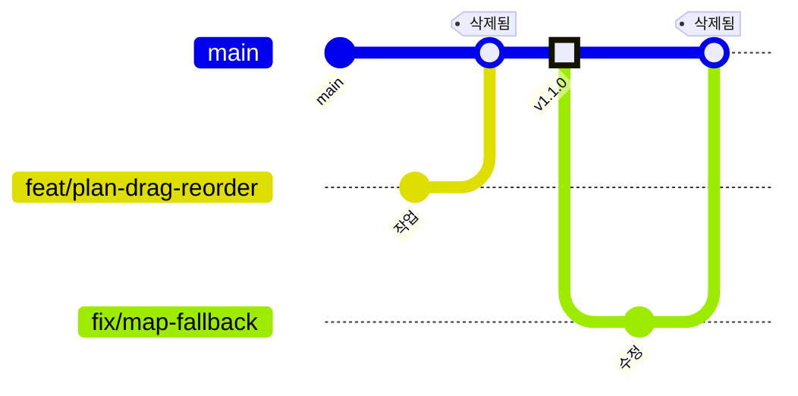

# 브랜치 전략 (다갈래)

> 2026-08-12 전면 재설계. 이전 전략에서 브랜치 16개·고아 stash 16개가 누적되어
> 폐기하고 새로 정의했다. 이 문서가 브랜치 운영의 유일한 기준이다.

---

## 0. 왜 다시 짰는가 — 이전 전략의 실패 분석

폐기 시점의 상태는 이랬다.

| 브랜치 | 개수 | 실제 내용 |
|---|---|---|
| `frontend_dev_1.0.0` ~ `1.6.0` | 7 | 서로 다른 커밋은 3개뿐. 나머지는 같은 커밋을 가리키는 껍데기 |
| `backend_dev_1.0.0`, `2.0.0` ~ `2.4.0`, `3.0.0` | 7 | 서로 다른 커밋은 2개뿐. 6개가 동일 커밋 |
| `claude/gracious-sanderson-d9e17a` | 1 | 자동화 스크립트 실험 |
| `main` | 1 | 유일한 통합 지점 |

원인은 `.claude/auto-commit.sh` 한 파일에 모여 있었다.

**원인 1 — 버전을 브랜치 이름에 인코딩했다 (가장 치명적)**

스크립트는 변경 내용을 보고 major/minor/patch를 판정한 뒤, minor 이상이면
`resolve_branch()`가 **새 버전 브랜치를 자동 생성**했다.

```bash
# auto-commit.sh (폐기됨)
elif [ "$new_count" -gt 0 ]; then
  echo "minor"        # ← 새 파일이 1개라도 생기면 minor
...
new_branch="${prefix}${new_ver}"
git checkout -b "$new_branch" "$current_branch"
```

즉 **파일 하나만 새로 만들어도 브랜치가 하나 늘어났다.** 컴포넌트 추가 같은
일상적인 작업이 전부 새 브랜치를 낳았고, 그래서 `1.0.0`부터 `1.6.0`까지 줄줄이 생겼다.

→ **교훈: 버전은 브랜치가 아니라 태그에 붙인다.** 브랜치는 "무슨 작업 중인가"를,
태그는 "어느 시점이 릴리스인가"를 나타내는 서로 다른 개념이다. 이걸 섞은 것이 근본 원인이다.

**원인 2 — 통합 지점으로 되돌아오는 경로가 없었다**

스크립트는 브랜치를 만들고 푸시할 뿐, main으로 머지하는 단계가 아예 없었다.
결과적으로 `backend_dev_3.0.0`에는 main에 없는 Java 파일 70개(약 8,000줄)가
고립된 채 쌓였고, 아무도 그 사실을 몰랐다.

→ **교훈: 브랜치를 만드는 자동화에는 반드시 브랜치를 닫는 경로가 함께 있어야 한다.**

**원인 3 — 실패를 조용히 삼켰다**

```bash
git stash push -u -m "auto-$label" -- $files
git checkout "$target"
git stash pop 2>/dev/null || true     # ← pop 실패가 무시된다
```

`stash pop`이 충돌로 실패해도 `|| true` 때문에 스크립트는 성공한 척 계속 진행했다.
그 결과 되돌려지지 않은 stash 16개가 조용히 누적됐다.

→ **교훈: 자동화의 실패는 반드시 눈에 보여야 한다. `|| true`는 상태를 바꾸는 명령에 쓰지 않는다.**

**원인 4 — iCloud Drive 위에서 저장소를 운영했다**

저장소 경로가 `~/Library/Mobile Documents/com~apple~CloudDocs/` 아래다.
iCloud가 동기화 충돌을 만들 때마다 `CLAUDE 2.md`, `settings 3.json`처럼
**공백 + 숫자**가 붙은 사본을 만드는데, 자동 커밋 훅이 `git add -A`로 이것들까지
전부 커밋했다. 현재 main에 이런 중복 파일이 **61개** 추적되고 있다.

→ **교훈: 동기화 폴더 위의 저장소는 `.gitignore`로 충돌 사본을 막아야 한다.**

---

## 1. 새 브랜치 모델 — Trunk-Based

`main` 하나를 줄기(trunk)로 두고, 짧게 사는 작업 브랜치만 붙였다 뗀다.



### 브랜치는 두 종류뿐이다

| 종류 | 수명 | 규칙 |
|---|---|---|
| `main` | 영구 | 항상 빌드 가능·배포 가능. **직접 커밋 금지** |
| 작업 브랜치 | 최대 3일 | 목적 하나당 하나. 머지 즉시 삭제 |

`develop`, `release/*`, `hotfix/*`는 두지 않는다. 배포 대상이 단일 환경이고
개발 인원이 소수라, GitFlow의 중간 계층은 관리 비용만 늘린다.

### 왜 Trunk-Based인가

- 이전 실패의 핵심은 **"브랜치가 오래 살아서 main과 멀어진 것"** 이다.
  `backend_dev_3.0.0`은 두 달 넘게 살아남아 결국 머지 불가능한 상태가 됐다.
- 브랜치 수명에 상한(3일)을 두면 이 실패가 구조적으로 재발할 수 없다.
- 통합 지점이 하나뿐이라 "지금 최신이 뭐냐"는 질문이 생기지 않는다.

---

## 2. 명명 규칙

```
<타입>/<도메인>-<요약>
```

타입은 커밋 컨벤션과 동일한 어휘를 쓴다.

| 타입 | 용도 | 예시 |
|---|---|---|
| `feat` | 새 기능 | `feat/restaurant-review-photo` |
| `fix` | 버그 수정 | `fix/plan-transit-fare-jp` |
| `refactor` | 동작 변경 없는 구조 개선 | `refactor/travel-service-split` |
| `chore` | 빌드·설정·의존성 | `chore/gradle-9-upgrade` |
| `docs` | 문서만 | `docs/architecture-rewrite` |
| `test` | 테스트만 | `test/plan-route-service` |

도메인은 백엔드 패키지명(`user`, `travel`, `plan`, `ai`, `restaurant`, `location`,
`accommodation`, `rental`, `cost`, `chat`) 또는 `frontend`, `infra`를 쓴다.

**금지**

- ❌ 버전 번호를 브랜치명에 넣지 않는다 — `feat/v2-plan` 같은 이름은 이전 실패의 재현이다
- ❌ `frontend_dev_*`, `backend_dev_*` 같은 **상시 브랜치**를 만들지 않는다
- ❌ 사람 이름·날짜·랜덤 문자열을 쓰지 않는다

---

## 3. 버전은 태그로 관리한다

이전 전략의 가장 큰 오류를 바로잡는 규칙이다.

```bash
# 릴리스는 main 위의 태그로만 표시한다
git tag -a v1.1.0 -m "맛집 추천 화면 연결"
git push origin v1.1.0
```

| | 브랜치 | 태그 |
|---|---|---|
| 의미 | 진행 중인 작업 | 확정된 시점 |
| 수명 | 며칠 | 영구 |
| 개수 | 동시에 1~3개 | 릴리스마다 1개 |

버전 판정(major/minor/patch)은 **사람이 릴리스 시점에** 한다. 스크립트가
파일 개수로 추측하게 두지 않는다 — 그 추측이 브랜치 14개를 만들었다.

- `major` — API 하위 호환 깨짐, DB 스키마 파괴적 변경
- `minor` — 사용자에게 보이는 기능 추가
- `patch` — 버그 수정, 내부 개선

---

## 4. 작업 흐름

```bash
# 1. 항상 최신 main에서 시작
git switch main && git pull

# 2. 작업 브랜치 생성
git switch -c feat/plan-drag-reorder

# 3. 작업 + 커밋 (의미 단위로)
git add -p && git commit -m "feat(plan): 일정 항목 드래그 정렬 추가"

# 4. main 변경사항 흡수 (매일 1회 이상)
git fetch origin && git rebase origin/main

# 5. 푸시 후 PR
git push -u origin feat/plan-drag-reorder
```

머지는 **squash merge**로 한다. 작업 브랜치의 중간 커밋("wip", "오타 수정")이
main 히스토리를 더럽히지 않게 하고, main의 커밋 1개 = 기능 1개를 유지한다.

```bash
# 6. 머지 후 즉시 삭제 — 예외 없음
git switch main && git pull
git branch -d feat/plan-drag-reorder
git push origin --delete feat/plan-drag-reorder
```

### 커밋 메시지

```
<타입>(<도메인>): <한 줄 요약>

<선택> 왜 이렇게 했는지
```

`auto: TravelListPage.tsx` 같은 **파일명 나열 커밋은 금지**한다.
main 히스토리 77개 중 상당수가 이런 커밋이라 지금 히스토리로는 아무것도 추적할 수 없다.

---

## 5. main 보호 규칙

GitHub 저장소 설정에서 `main`에 다음을 건다.

- Require a pull request before merging
- Require status checks to pass — 백엔드 `./gradlew build`, 프론트 `npm run build`
- 직접 push 금지 (force push 포함)
- 머지된 브랜치 자동 삭제 (Automatically delete head branches)

마지막 항목은 브랜치 누적을 저장소 차원에서 막아주므로 반드시 켠다.

---

## 6. 자동화 규정

자동 커밋 훅은 **브랜치를 만들거나 이동하지 않는다.** 이전 실패의 직접 원인이었다.

허용되는 자동화의 경계:

| 동작 | 허용 |
|---|---|
| 현재 브랜치에 커밋 | ⭕ (단, main에서는 금지) |
| 현재 브랜치를 push | ⭕ |
| 새 브랜치 생성 | ❌ |
| `git checkout` / `git switch` | ❌ |
| `git stash` | ❌ |
| `git add -A` | ❌ — 경로를 명시할 것 |

`git add -A`를 금지하는 이유는 iCloud 충돌 사본(`* 2.md`)까지 쓸어 담기 때문이다.

훅이 main 위에서 돌면 아무것도 하지 않고 종료해야 한다. main은 PR로만 바뀐다.

---

## 7. iCloud 충돌 사본 차단

`.gitignore`에 다음을 추가한다.

```gitignore
### iCloud Drive 동기화 충돌 사본 차단 ###
* [0-9].*
* [0-9][0-9].*
*의 충돌 사본*
```

이미 추적 중인 61개는 별도로 제거한다 (`docs/cleanup-plan.md` 참고).

> 근본적으로는 저장소를 iCloud 밖(`~/dev/dagalle` 등)으로 옮기는 편이 낫다.
> iCloud는 `.git` 내부 파일도 동기화 대상으로 삼아 저장소 손상 위험이 있다.

---

## 8. 요약 — 한 장

| 항목 | 규칙 |
|---|---|
| 통합 브랜치 | `main` 하나 |
| 작업 브랜치 | `<타입>/<도메인>-<요약>`, 최대 3일 |
| 버전 표기 | 브랜치 ❌ → **태그 `vX.Y.Z`** ⭕ |
| 머지 방식 | PR + squash merge |
| 머지 후 | 브랜치 즉시 삭제 |
| 자동화 | 커밋·푸시만. 브랜치 생성·checkout·stash 금지 |
| 동시 브랜치 수 | 3개 이하 유지 |
